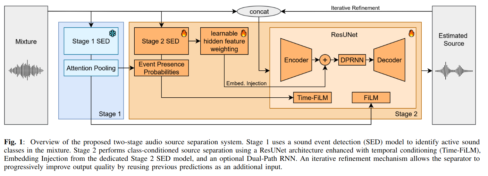
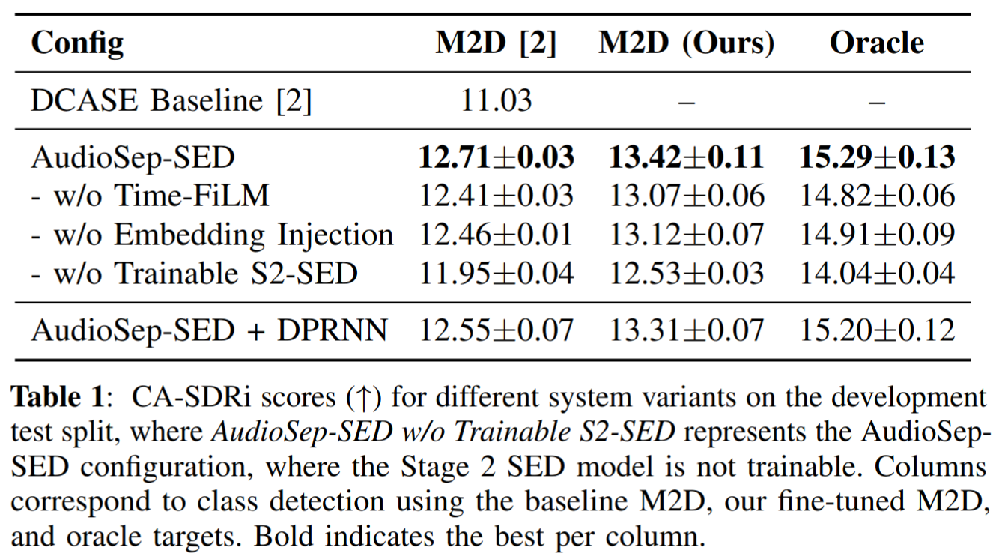
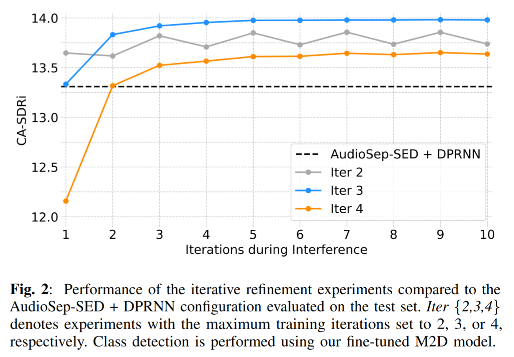

# Audio Source Separation with Sound Event Detection for DCASE 2025 Task 4

This repository contains the implementation for our paper submitted to the [DCASE 2025 Workshop](https://dcase.community/documents/workshop2025/proceedings/DCASE2025Workshop_Morocutti_76.pdf). 

We participated in **Task 4: Sound Event Detection and Separation** of the DCASE 2025 challenge and achieved **2nd place** in the competition.

This code builds on the baseline implementation for DCASE 2025 Task 4: https://github.com/nttcslab/dcase2025_task4_baseline

## Overview

Our system consists of two components:
1. **Sound Event Detection (SED) Model**: M2D-based tagger for detecting sound events in mixtures
2. **Source Separation Model**: ResUNet-based separator with Soundbeam conditioning and optional iterative refinement

The system uses a novel **Soundbeam** conditioning mechanism that enables the separator to leverage embeddings from a pre-trained sound event detection model to guide source separation.

## Method


*Figure 1: Overall architecture of our system*

## Results


*Table 1: Quantitative results on DCASE 2025 Task 4 test set*


*Figure 2: Performance of models using the iterative refinement mechanism with different values for the maximal number of iterations used during training. *

## Environment Setup

### Using Conda

```bash
# Clone the repository
git clone <repository-url>
cd dcase25task4

# Create conda environment
conda create -n dcase25t4 python=3.11
conda activate dcase25t4

# Install requirements; should also install PyTorch (adjust for your CUDA version)
pip install -r requirements.txt

# Install additional packages
CFLAGS='-O3 -march=native' pip install https://github.com/f0k/minimp3py/archive/master.zip
pip install datasets==3.2.0
pip install dcase-util==0.2.20
pip install git+https://github.com/fgnt/sed_scores_eval.git

# Setup wandb for logging
wandb login
```

### Installing SpatialScaper

The data generation pipeline requires SpatialScaper:

```bash
git clone https://github.com/iranroman/SpatialScaper.git
cd SpatialScaper
pip install -e .
cd ..
```

### System Requirements

SoX may be required:
```bash
sudo apt-get update && sudo apt-get install -y gcc g++ sox libsox-dev
```

## Data Setup

Look at the README.md file of the [baseline repository](https://github.com/nttcslab/dcase2025_task4_baseline) for instructions on how to download and prepare the DCASE 2025 Task 4 dataset. 
For running the code in this repository, you don't have to create the symbolic link from 'data/' to the dataset directory.

## Training

All training logs and checkpoints are saved to the `outputs/` directory.

### Training Commands

#### Sound Event Detection Model

The M2D sound event detection model we use is pre-trained on AudioSet Strong in the setup of [PretrainedSED](https://github.com/fschmid56/PretrainedSED).
When running the following command to fine-tune the M2D model, the pre-trained weights will be automatically downloaded.
To fine-tune the M2D model on the DCASE 2025 Task 4 training set, run:

```bash
python -m src.train --config config/sound_event_detection_models/m2d.yaml --wandb_name m2d
```

This model will be used as Stage 1 SED model and also as Stage 2 SED model for temporal guidance in the separation models.

#### Source Separation Models

We now use only **2 base configurations** with command-line arguments to create all model variants:

**Base Configurations:**

1. **Non-Iterative Models** (`separator_non_iterative.yaml`):
   - Baseline model (Soundbeam + TimeFiLM, trainable Soundbeam)
   - Ablation studies (without Soundbeam, without TimeFiLM, frozen Soundbeam)
   - DPRNN variant

2. **Iterative Models** (`separator_iterative.yaml`):
   - All iterative refinement variants (2, 3, 4 iterations)

**Training Commands:**

**1. Baseline Model** (Soundbeam + TimeFiLM, trainable Stage 2 SED model):
```bash
python -m src.train --config config/separation_models/separator_non_iterative.yaml --wandb_name separator_baseline
```

**2. Without TimeFiLM** (Soundbeam only, trainable Stage 2 SED model):
```bash
python -m src.train --config config/separation_models/separator_non_iterative.yaml --no_time_film --wandb_name separator_no_timefilm
```

**3. Without Soundbeam** (TimeFiLM only, trainable Stage 2 SED model):
```bash
python -m src.train --config config/separation_models/separator_non_iterative.yaml --no_soundbeam --wandb_name separator_no_soundbeam
```

**4. With Frozen Soundbeam** (Soundbeam + TimeFiLM, frozen Stage 2 SED model):
```bash
python -m src.train --config config/separation_models/separator_non_iterative.yaml --soundbeam_frozen --wandb_name separator_soundbeam_frozen
```

**5. With DPRNN** (Baseline + DPRNN):
```bash
python -m src.train --config config/separation_models/separator_non_iterative.yaml --use_dprnn --lr_dprnn 0.0005 --val_batch_size 1 --wandb_name separator_dprnn
```

**6. Iterative Refinement (2 iterations)**:
```bash
python -m src.train --config config/separation_models/separator_iterative.yaml --max_iterations 2 --wandb_name separator_iter_2
```

**7. Iterative Refinement (3 iterations)**:
```bash
python -m src.train --config config/separation_models/separator_iterative.yaml --max_iterations 3 --train_batch_size 1 --wandb_name separator_iter_3
```

**8. Iterative Refinement (4 iterations)**:
```bash
python -m src.train --config config/separation_models/separator_iterative.yaml --max_iterations 4 --train_batch_size 1 --wandb_name separator_iter_4
```

**Available Command-Line Arguments:**

- `--max_iterations N`: Set maximum iterations for iterative models
- `--use_time_film` / `--no_time_film`: Enable/disable TimeFiLM
- `--use_dprnn` / `--no_dprnn`: Enable/disable DPRNN
- `--soundbeam_apply` / `--no_soundbeam`: Enable/disable Soundbeam
- `--soundbeam_trainable` / `--soundbeam_frozen`: Make Soundbeam trainable/frozen
- `--lr_dprnn FLOAT`: Set DPRNN learning rate
- `--train_batch_size N`: Override training batch size
- `--val_batch_size N`: Override validation batch size
- `--learning_rate FLOAT`: Override learning rate

### Resuming Training

To resume training from a checkpoint:
```bash
python -m src.train --config config/separation_models/separator_non_iterative.yaml --resume outputs/checkpoints/separator_baseline/<wandb_id>/last.ckpt
```

## Checkpoints

We provide pre-trained checkpoints for each training configuration. Each checkpoint corresponds to one of the training configurations described above.

Available checkpoints:
- `m2d_tagging.ckpt` - Sound event detection model
- `separator_baseline.ckpt` - Baseline separator model
- `separator_no_timefilm.ckpt` - Separator without TimeFiLM
- `separator_no_soundbeam.ckpt` - Separator without Soundbeam
- `separator_soundbeam_frozen.ckpt` - Separator with frozen Soundbeam
- `separator_dprnn.ckpt` - Separator with DPRNN
- `separator_iter_2.ckpt` - Separator with 2-iteration refinement
- `separator_iter_3.ckpt` - Separator with 3-iteration refinement
- `separator_iter_4.ckpt` - Separator with 4-iteration refinement


## Evaluation

### Evaluation Logic and SED Model Stages

Our system uses **two different SED models** with distinct roles:

#### **Stage 1 SED Model (Label Prediction for Evaluation):**
- **Purpose**: Predicts sound event labels for separator evaluation
- **Configuration**: `evaluation_tagger_model` in YAML files
- **During Training Validation**: Uses baseline M2D (`checkpoint/m2dat.ckpt`) for consistent evaluation
- **During Testing**: Uses the trained tagger model loaded from checkpoint
- **Output**: Provides label predictions for CA-SDR calculation
- **Files**: `test_baseline_tagger_predictions.json` and `val_baseline_tagger_predictions.json`

#### **Stage 2 SED Model (Embedding Injection for Separation):**
- **Purpose**: Provides embeddings for Soundbeam and TimeFiLM conditioning
- **Configuration**: `soundbeam.tagger_model` in YAML files
- **Training**: Fine-tuned together with the separator (if `trainable: true`)
- **Features**: Provides `embeddings` and `logits_strong` for the separator
- **Integration**: Injected into separator architecture for enhanced performance

#### **Evaluation Approach:**

**During Training Validation:**
- **Stage 1**: Uses pre-computed predictions from baseline M2D model
- **Stage 2**: Uses the trained embedding model (if Soundbeam/TimeFiLM enabled)
- **Purpose**: Consistent evaluation baseline across all separator experiments

**During Testing (`trainer.test()`):**
- **Stage 1**: Uses the trained tagger model from checkpoint (any model can be loaded)
- **Stage 2**: Uses the trained embedding model from checkpoint
- **Purpose**: End-to-end evaluation with the actual trained models
- **Note**: The `test.py` script preserves the `evaluation_tagger_model` configuration for Stage 1 evaluation

#### **Why This Two-Stage Approach:**
- **Consistent Evaluation**: Stage 1 ensures fair comparison between separator architectures
- **Enhanced Separation**: Stage 2 provides rich embeddings for better separation quality
- **Flexible Testing**: Any trained tagger model can be used for Stage 1 during testing
- **Focused Assessment**: Separates evaluation consistency from separation enhancement

### Evaluate Models

#### **Testing Tagger Models:**
```bash
python -m src.test --config config/test_tagger.yaml --checkpoint path/to/tagger_checkpoint.ckpt
```

#### **Testing Separator Models:**
```bash
python -m src.test --config config/test_separator.yaml --checkpoint path/to/separator_checkpoint.ckpt
```

**Note**: The separator test config includes the `evaluation_tagger_model` configuration needed for separator evaluation.

## Citation

If you use this code, please cite our paper:

```bibtex
@inproceedings{Morocutti2025,
    author = "Morocutti, Tobias and Greif, Jonathan and Primus, Paul and Schmid, Florian and Widmer, Gerhard",
    title = "On Temporal Guidance and Iterative Refinement in Audio Source Separation",
    booktitle = "Proceedings of the 10th Workshop on Detection and Classification of Acoustic Scenes and Events (DCASE 2025)",
    address = "Barcelona, Spain",
    month = "October",
    year = "2025",
}
```